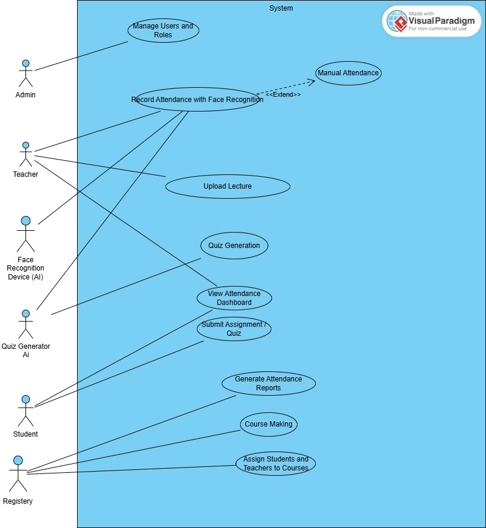

# Smart University Ecosystem: Project Requirements Specification

**Date:** 2025-11-04  
**GitHub Repository:** [https://github.com/your-repo-link](https://github.com/your-repo-link)

---

## Team Members and Roles

| Team Member | Role                                          |
|-------------|-----------------------------------------------|
| Adam Mhamad | Role 1 – Requirements Elicitation Lead        |
| Rewan       | Role 2 – Requirements Classification Specialist |
| San         | Role 3 – Use Case Modeller                    |
| San         | Role 4 – Structured Specification Developer   |
| Sovin       | Role 5 – Requirements Prioritization Analyst  |
| Bagzad      | Role 6 – Validation & QA Lead                 |

---

## 1. Requirements Elicitation (Role 1)

We used **interviews** and **brainstorming sessions** to gather requirements from key stakeholders: teachers, registrars, and students.

### Key Findings:

*   **Teachers:** Face challenges with manual attendance, which is time-consuming and prone to errors. They desire an automated face-recognition system, a dashboard to upload lecture PDFs, and AI-powered tools to generate quizzes.
*   **Registrars:** Need a streamlined process for receiving and managing attendance data. They require automated reports and a centralized system for course and student management.
*   **Students:** Want a modern dashboard to track their attendance, grades, and schedules. They are also interested in gamification and AI-powered study planners.

*For detailed interview notes, please see the [full requirements document](https://github.com/your-repo-link/blob/main/REQUIRNMET_FULL.md) on our GitHub.* 

---

## 2. Requirements Classification (Role 2)

All gathered requirements were classified into Functional (FR) and Non-Functional (NFR) categories.

### Functional Requirements (Sample)

| ID     | Requirement Description                                                      |
|--------|------------------------------------------------------------------------------|
| FR-002 | Digital attendance system supporting automatic (face recognition) and manual input. |
| FR-006 | Teacher dashboards for uploading lecture materials and generating AI quizzes.      |
| FR-010 | Smart student planner with references, video links, and personalized learning.   |

### Non-Functional Requirements (Sample)

| ID      | Requirement Description                                         | Category      |
|---------|-----------------------------------------------------------------|---------------|
| NFR-001 | Data encryption for sensitive information.                      | Security      |
| NFR-005 | Mobile and desktop responsive interface.                        | Usability     |
| NFR-012 | Performance: quick attendance capture and reporting without delay. | Performance   |

*A complete list of classified requirements is available in the [full requirements document](https://github.com/your-repo-link/blob/main/REQUIRNMET_FULL.md) on our GitHub.*

---

## 3. Use Case Modeling (Role 3)

The system's interactions are modeled through use cases for each actor.

### System Overview Use Case Diagram

### Key Actors

*   **Teacher:** Manages attendance, lectures, and quizzes.
*   **Student:** Views academic progress and accesses learning materials.
*   **Registrar:** Manages courses, schedules, and official records.
*   **Admin:** Oversees the system, users, and security.

*Detailed use cases for each actor can be found in our [USE_CASES.md](https://github.com/your-repo-link/blob/main/USE_CASES.md) file.*

---

## 4. Structured Specification (Role 4)

Critical functional requirements were specified in detail. Here is an example for the Digital Attendance System:

### FR-002: Digital Attendance System

| | |
| :--- | :--- |
| **Purpose** | To automate the attendance process using face recognition and provide a manual override for teachers. |
| **Normal Behavior** | 1. The system captures video from the classroom camera. 2. It detects and recognizes registered students. 3. For each recognized student, the system marks them as 'Present'. 4. The teacher can view and manually correct the attendance on their dashboard. |
| **Exceptions** | - **Camera not available:** The system switches to manual attendance mode. - **Low recognition accuracy:** The system notifies the teacher for manual verification. |

*The full structured specifications for other critical requirements are in our [STRUCTURED_SPECIFICATIONS.md](https://github.com/your-repo-link/blob/main/STRUCTURED_SPECIFICATIONS.md) file.*

---

## 5. Requirements Prioritization (Role 5)

Requirements were prioritized using the MoSCoW method to define the MVP scope.

### Prioritization Summary

*   **Mandatory (M):** 36 requirements
*   **Nice to Have (N):** 7 requirements
*   **Superfluous (S):** 4 requirements

### Sample of Prioritized Requirements

| Req. No. | Requirement Description | Priority (M/N/S) | Reason |
| :--- | :--- | :--- | :--- |
| R1 | Webcam-based face detection (recognition). | M | Core MVP feature; directly solves manual attendance. |
| R29 | Gamified student scoring system. | N | Encourages engagement; not critical for MVP. |
| R15 | Permanent storage of face images. | S | Conflicts with privacy; avoid for MVP. |

*The complete prioritized list is available in the [REQUIREMENT_PRIORITIZATION.md](https://github.com/your-repo-link/blob/main/REQUIREMENT_PRIORITIZATION.md) file.*

---

## 6. Validation & Quality Assurance (Role 6)

A validation and verification strategy is in place to ensure the system is built correctly and meets user needs.

### Key Risks

1.  **Accuracy and Bias in Face Recognition:** Mitigated by including a manual override for teachers and using diverse training data.
2.  **Quality of AI-Generated Quizzes:** Mitigated by implementing a teacher review and approval workflow.

### V&V Strategy

*   **Verification ("Did we build the system right?"):** Achieved through developer-led unit tests, integration tests, and code reviews.
*   **Validation ("Did we build the right system?"):** Achieved through stakeholder-led activities, including prototype reviews and a pilot program.

*Our full validation plan is detailed in the [REQUIREMENTS_VALIDATION.md](https://github.com/your-repo-link/blob/main/REQUIREMENTS_VALIDATION.md) file on GitHub.*
